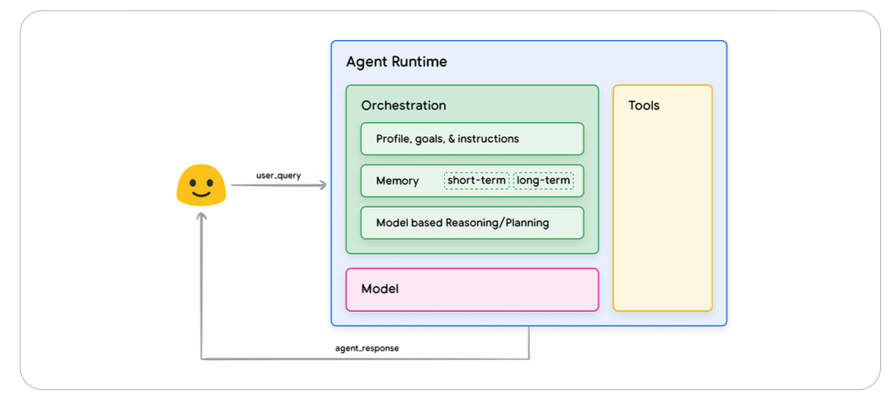
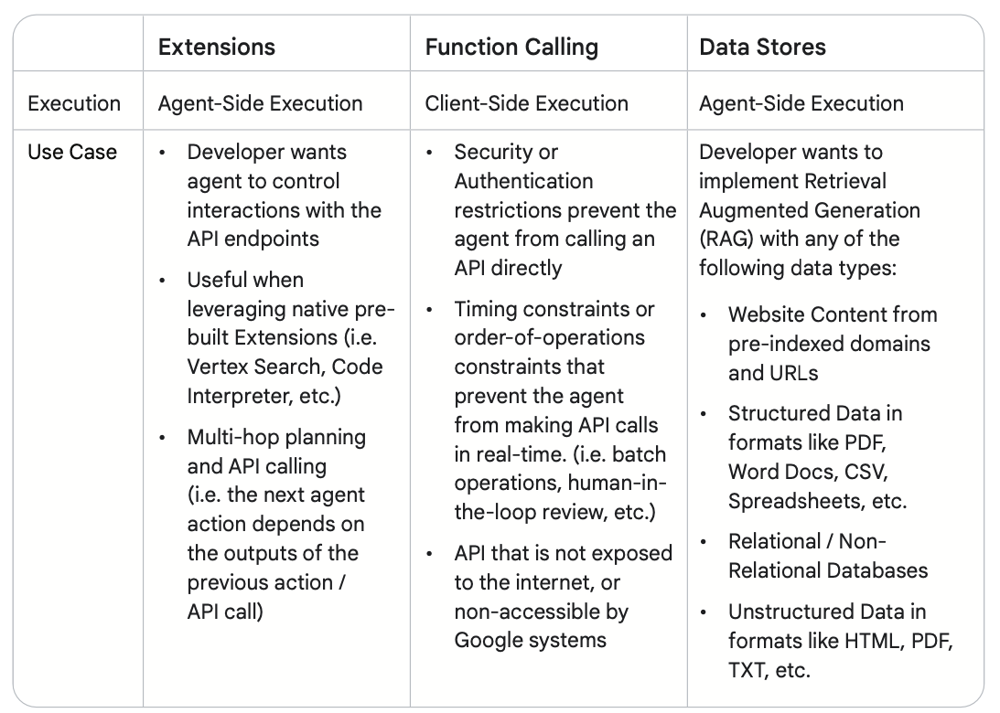

# Day 3 - Generative Agents

1. Complete Unit 3: “Generative Agents”, which is:
   - [Optional] Listen to the [summary podcast](https://www.youtube.com/watch?v=H4gZd4BCrDQ) episode for this unit (created by NotebookLM).
   - Read the “[Generative AI Agents](../reference/Newwhitepaper_Agents2.pdf)” whitepaper.
   - [Optional] Read [a case study](https://cloud.google.com/blog/products/ai-machine-learning/regnology-automates-ticket-to-code-with-genai-on-vertex-ai?e=48754805) which talks about how a leading technology regulatory reporting solutions provider used an agentic generative AI system to automate ticket-to-code creation in software development, achieving a 2.5x productivity boost.
   - Complete these code labs:
        1. [Talk](../codes/day-3-function-calling-with-llamaIndex.ipynb) to a database with function calling
        2. [Build](https://www.kaggle.com/code/markishere/day-3-building-an-agent-with-langgraph/) an agentic ordering system in LangGraph

2. Watch the [YouTube livestream recording](https://www.youtube.com/watch?v=HQUtMWoTAD4&list=PLqFaTIg4myu-b1PlxitQdY0UYIbys-2es&index=4). Paige Bailey will be joined by expert speakers from Google - Steven Johnson, Julia Wiesinger, Alan Blount, Patrick Marlow, Wes Dyer, Anant Nawalgaria to discuss generative AI agents.

## Reading Notes

### What is an agent?
A Generative AI agent can be defined as an application that attempts to achieve a goal by observing the world and acting upon it using the tools that it has at its disposal.

There are three essential components in an agent's cognitive architecture showed in the figure below:

- **Model**: refers to the language model (LM) that will be utilized as the centralized decision maker for agent processes. The model used by an agent can be one
or multiple LM’s of any size (small / large) that are capable of following instruction based
reasoning and logic frameworks, like ReAct, Chain-of-Thought, or Tree-of-Thoughts.
- **Tools**: Bridges the gap between the agent's internal capabilities and the external world. E.g. a tool can update customer information in a database, or it can send an email to a customer. With tools, agents can access and process real-world information. 
- **Orchestration**:  Describes a cyclical process that governs how the agent takes in
information, performs some internal reasoning, and uses that reasoning to inform its next
action or decision.

### Tools

- **Extensions**: Bridging the gap between an API and an agent in a standardized way, allowing agents to seamlessly execute APIs regardless of their underlying implementation:
  - Teaching the agent how to use the API endpoint using examples.
  - Teaching the agent what arguments or parameters are needed to successfully call the API endpoint.
- **Functions**: Functions offer a straightforward framework that empowers application developers with fine-grained control over data flow and system execution, while effectively leveraging the agent/model for critical input generation
- **Data stores**: Provides access to more dynamic
and up-to-date information, and ensuring a model’s responses remain grounded in factuality
and relevance.

--------------------
A crucial aspect of using models effectively is their ability to choose the right tools when generating output, especially when using tools at scale in production. To help with this, several approaches exist:
- in-context learning. The ReAct framework is an example of this.
- Retrieval-based in-context learning. An example would be the data stores RAG based architecture.
- Fine-tuning based learning. This method involves training a model using a larger dataset of specific examples prior to inference. 