# General Knowledge of Natural Language - Notes

*The notes are based on the Georgia Tech CS7650 course.*

## Fundamentals of Language Models

### Encoder and Decoder

**Encoder**: A neural network component that converts input data into a useful hidden representation. In early neural language models, this often looks like compression: the input is forced through a smaller latent representation so the network must keep the most useful information and discard irrelevant detail. In later architectures such as Transformers, the representation is not always a single small bottleneck vector; it can be a stack of contextual embeddings, one per token.

The encoder learns parameters that:

1. Create a compact representation that preserves the most important features of the input
2. Minimize information loss during compression
3. Enable effective reconstruction or prediction by the downstream decoder

A successful encoder will:

1. Represent the input data with minimal corruption or loss of critical information
2. Create embeddings that capture meaningful patterns and relationships
3. Generate representations that can be effectively decoded into useful target predictions

**Decoder**: The complementary component that maps an encoded representation into the target output space. In an autoencoder this may mean reconstructing the original input; in a language model it usually means predicting the next token or generating an output sequence. The decoder:

1. Takes the compressed latent representation as input
2. Applies learned transformations to expand the representation
3. Generates predictions in the target output space, often as a probability distribution over vocabulary tokens

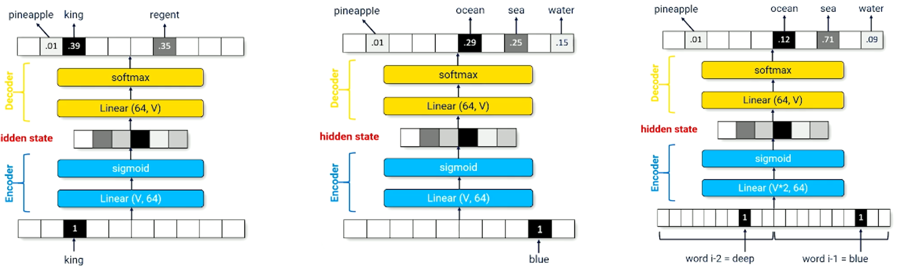
*Figure 1: Encoder-decoder architecture showing compression of input into latent space and subsequent decoding to output space. Left: identity function demonstrating basic reconstruction, middle: bigram model for 2-token context, right: trigram model for 3-token context.*

Summary:

- Simple encoders often perform dimensionality reduction through compression, which:
    - Forces the model to learn efficient representations
    - Promotes generalization by preventing memorization
    - Creates a bottleneck that captures essential patterns

- Key limitations of fixed-window encoder-decoder models:
    1. Different architectures are required for different n-gram sizes (bigrams, trigrams, etc.), making the approach inflexible
    2. Context is strictly limited to the chosen n-gram window size
    3. No ability to capture long-range dependencies or broader context beyond the fixed n-gram size

### Recurrent Neural Networks (RNN)
RNNs are neural networks designed to process sequential data by maintaining an internal hidden state that captures information from previous inputs. Key characteristics include:

- The hidden state acts as a memory mechanism, encoding useful information about previous tokens in the sequence
- At each time step, the RNN combines the previous hidden state with the current input token to produce:
    1. A new hidden state for the next time step
    2. A prediction distribution for the next token

The process can be visualized in the following diagram:

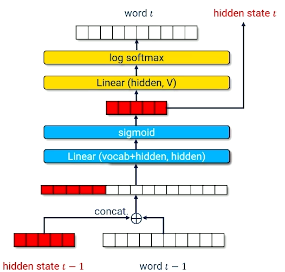

*Figure 2: RNN element showing how the hidden state is updated and output is generated at each time step t.*

#### Training an RNN
The training process involves:

Input data for one training step:

- $x$: token ID of the previous word ($w_{t-1}$)
- $h_{t-1}$: previous hidden state
- $y$: target token ID of the current word ($w_t$)

Forward Pass:

1. Process input token and previous hidden state through the network
2. Output: Vector of log probabilities for each word in vocabulary: $(\log P(w_1), ..., \log P(w_i), ..., \log P(w_{|v|}))$
3. Loss: Cross entropy between predicted and actual next token: $L = -\log P(w_i)$ where $w_i$ is the actual next token

##### Generating Text with an RNN
Text generation follows these steps:

1. Initialization:
    - Start with a seed word ($word_t$)
    - Initialize hidden state to zeros

2. Generation Loop:
    - Network produces probability distribution over vocabulary: $(P(w_1), ..., P(w_i), ..., P(w_{|v|}))$
    - Apply temperature scaling to logits before sampling: $(\frac{\log P(w_1)}{T}, ..., \frac{\log P(w_i)}{T}, ..., \frac{\log P(w_{|v|})}{T})$
        - $T > 0$
        - $T < 1$ sharpens the distribution and makes sampling more deterministic
        - $T = 1$ leaves the distribution unchanged
        - $T > 1$ flattens the distribution and increases randomness
    - Sample next token ($word_{t+1}$) from scaled distribution
    - Feed generated token and updated hidden state back as input
    - Repeat process for desired length of text

#### Recap
Key points about RNN language models:

Language models express the probability of sequences:

$$P(w_1, ..., w_n) = \prod_{i=1}^{n} P(w_i | w_1, ..., w_{i-1}; \theta)$$

- Advantages:
    - Can handle variable-length sequences
    - Theoretically able to capture arbitrary-length dependencies
    - More flexible than fixed n-gram models

- Limitations:
    - In practice, struggle to maintain long-term dependencies
    - Information gradually "fades" as it's repeatedly compressed into fixed-size hidden state
    - Training can be unstable due to vanishing/exploding gradients
    - Sequential nature makes parallelization difficult

### Long Short-Term Memory (LSTM)
Long Short-Term Memory (LSTM) networks are a specialized type of RNN designed to better handle long-term dependencies in sequential data. LSTMs replace the simple neural network layer in traditional RNNs with a more sophisticated memory cell structure.

#### Core Components
The LSTM architecture has two main state components:

- **Hidden State**: Summarizes the processed information and serves as the output at each time step
- **Cell State**: Acts as the network's long-term memory, carefully regulated by several gates to maintain and update relevant information

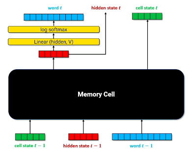

*Figure 3: LSTM architecture showing the replacement of RNN's simple layer with the memory cell*

#### Memory Cell Structure
The LSTM memory cell contains three specialized gates that control information flow:

In the formulas below, $x_t$ means the input token representation at the current recurrent step, and $h_{t-1}$ means the previous hidden state.

1. **Forget Gate**
    - Controls what information should be discarded from the cell state
    - Uses a sigmoid activation function that outputs values between 0 and 1
    - Values closer to 0 indicate information to forget, while values closer to 1 indicate information to keep
    - Mathematically: $f_t = \sigma(W_f[h_{t-1}, x_t] + b_f)$

2. **Input Gate**
    - Consists of two components working together:
    - Sigmoid layer: Determines which cell state values should be updated
    - Tanh layer: Creates a vector of new candidate values that could be added to the state
    - Combined, they determine what new information will be stored in the cell state
    - Mathematically: $i_t = \sigma(W_i[h_{t-1}, x_t] + b_i)$ and $\tilde{C}_t = \tanh(W_C[h_{t-1}, x_t] + b_C)$

3. **Output Gate**
    - Controls what parts of the cell state should be output as the hidden state
    - Sigmoid layer selects which parts of the cell state will be output
    - Tanh function scales the cell state values to between -1 and 1
    - Final output is produced by multiplying these components
    - Mathematically: $o_t = \sigma(W_o[h_{t-1}, x_t] + b_o)$

The cell state and hidden state are then updated with element-wise multiplication:

$$C_t = f_t \odot C_{t-1} + i_t \odot \tilde{C}_t$$

$$h_t = o_t \odot \tanh(C_t)$$

This is the key reason LSTMs help with long-term dependencies: the cell state gives information a relatively direct path through time, while the gates learn what to keep, erase, and expose.

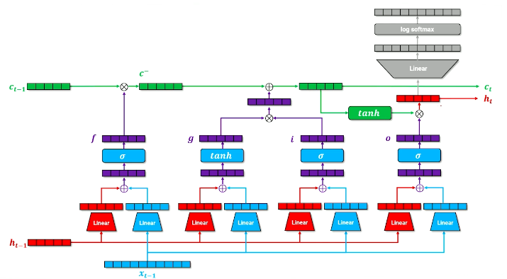

*Figure 4: Detailed structure of the LSTM memory cell showing the three gates and their interactions*

#### Advantages and Limitations

- **Advantages**:
    - Better at capturing long-term dependencies compared to standard RNNs
    - More stable gradient flow during training
    - Explicit control over memory retention and updates
  
- **Limitations**:
    - Still faces challenges with very long sequences
    - More complex architecture requires more computational resources
    - May struggle with context windows beyond certain lengths

### Sequence-to-Sequence Models
Sequence-to-sequence (Seq2Seq) models are designed to transform one sequence into another sequence, potentially of different lengths. Common applications include:

- Machine translation
- Text summarization 
- Question answering
- Code generation

#### Architecture Overview
The model consists of two main components:

1. **Encoder**: Processes the input sequence and compresses it into a context vector or a sequence of hidden states
2. **Decoder**: Generates the output sequence based on the context vector or encoder hidden states

#### Input/Output Format

- **Input**: Variable-length sequence of tokens (words, subwords, or characters)
- **Output**: Variable-length sequence of tokens, which can be different from the input sequence

#### Processing Steps

1. **Encoding Phase**
    - The encoder processes the input sequence token by token
    - In vanilla seq2seq, creates a fixed-length context vector that attempts to summarize the entire input
    - This representation should capture:
        - Negations
        - Adjective ordering
        - Syntactic relationships
        - Long-range dependencies
    - The fixed-vector bottleneck is also a limitation: long or information-dense inputs can be hard to compress into one vector

2. **Decoding Phase**
    - Starts with the context vector from the encoder
    - Generates output tokens one at a time
    - Each generated token influences the next token's prediction
    - Continues until a special End-of-Sequence (EOS) token is generated

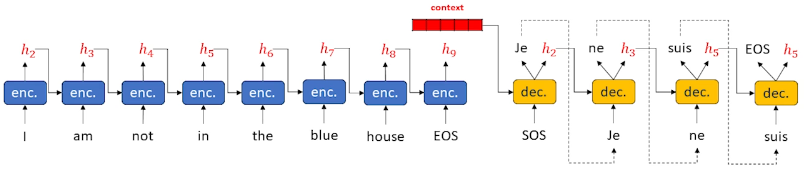

*Figure 5: Sequence-to-sequence model showing the encoding of an input sequence into a hidden state context vector and subsequent decoding to generate an output sequence.*

#### Key Innovations

1. **Separate Encoder-Decoder Architecture**
    - Allows processing of input and output sequences independently
    - Can handle different vocabularies and lengths for input/output

2. **Modified Decoder**
    - Takes both the previous output token and hidden state as input
    - Enables more contextual and coherent sequence generation

3. **Foundation for Attention**
    - This architecture laid the groundwork for attention mechanisms
    - Attention allows the decoder to focus on different parts of the input sequence
    - Critical development for modern language models

#### Seq2Seq Training
The training process for sequence-to-sequence models involves carefully coordinating the encoder and decoder components to learn how to transform input sequences into desired output sequences.

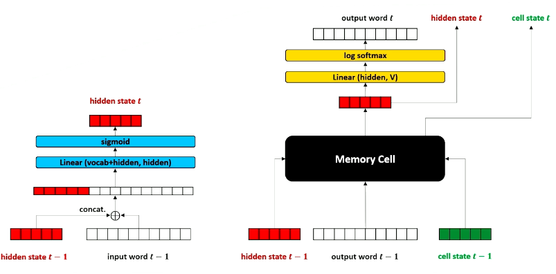

*Figure 6: Side-by-side comparison of the encoder and decoder in a sequence-to-sequence model. The decoder uses an LSTM architecture to generate the output sequence.*

##### Training Process Step-by-Step
The model processes special tokens to mark sequence boundaries:

- SOS (Start of Sequence): Indicates the beginning of a sequence
- EOS (End of Sequence): Indicates the end of a sequence

Input sequence: $x = \text{SOS}, x_1, ..., x_n, \text{EOS}$
Output sequence: $y = \text{SOS}, y_1, ..., y_m, \text{EOS}$

**Encoding Phase:**

1. Initialize encoder hidden state $h_0^{enc}$ as a zero vector
2. For each input token $x_j$ until EOS is reached:
    - Feed token $x_j$ and previous hidden state $h_j^{enc}$ into encoder
    - Get next hidden state $h_{j+1}^{enc}$

**Decoding Phase:**

1. Initialize decoder:
    - First input token $x_0^{dec} = \text{SOS}$
    - Initial hidden state $h_0^{dec} = h_n^{enc}$ (final encoder state)
2. For each time step $k$ until EOS or max length:
    - Feed $x_k^{dec}$ and $h_k^{dec}$ into decoder
    - Get prediction $\hat{y}_{k+1}^{dec}$ and next hidden state $h_{k+1}^{dec}$
    - Use prediction as next input: $x_{k+1}^{dec} = \hat{y}_{k+1}^{dec}$
    - Calculate loss between prediction and true label: $\text{loss} += loss\_fn(y_{k+1}, \hat{y}_{k+1}^{dec})$
3. Backpropagate the accumulated loss to update model parameters

##### Teacher Forcing: Accelerating Training
Teacher forcing is a powerful training technique that significantly improves the learning process for sequence-to-sequence models.

**Core Concept:**
Instead of using the decoder's potentially incorrect predictions as inputs for the next time step, teacher forcing uses the actual correct outputs (ground truth) from the training data. This modifies the decoding loop to:

- do until $y_k$ = EOS or we reach max length
    - decode $y_k$ and $h_k^{dec}$ to get $\hat{y}_{k+1}^{dec}$ and $h_{k+1}^{dec}$
    - $x_{k+1}^{dec} = y_{k+1}$

Reason to use teacher forcing:

- Early in training, decoder outputs are very random, so feeding those predictions back into the decoder can quickly produce out-of-distribution sequences
- It is hard to learn if the decoder rarely sees realistic prefixes and therefore rarely produces low-loss outputs
- Teacher forcing is like having the teacher correct you after every step, then asking what you would do next from the corrected state

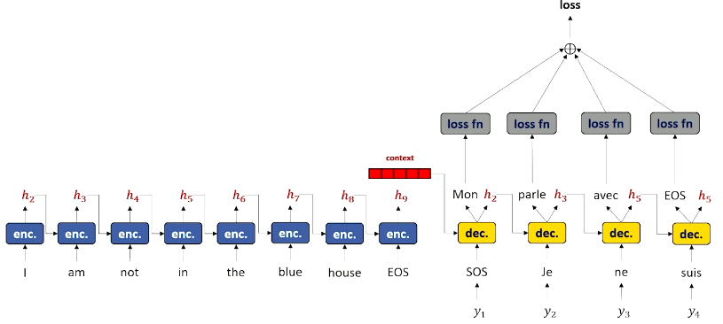

*Figure 7: Teacher forcing is a technique used in sequence-to-sequence models to train the decoder. It involves using the true output at each time step as the input to the next time step, rather than using the model's own prediction. This helps the model learn to generate the correct output sequence.*

### Attention
Let's understand how attention works in a seq2seq model. 

**Attention**: a mechanism that lets the decoder look back through the input and place a "spotlight" on the encoder positions most relevant to the next output-token prediction.

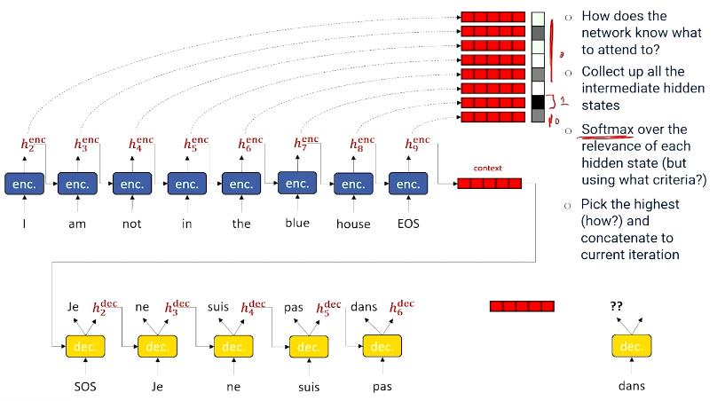

*Figure 8: Attention mechanism in a sequence-to-sequence model. The decoder uses attention to focus on different parts of the input sequence when generating the output.*

**Decoder**:

1. Embed word $t-1$, reducing it from vocabulary size $|V|$ to the hidden-state size
2. Concatenate the embedded word with the decoder hidden state. This is the context used to decide what to attend to.
3. Resize the combined vector to match the maximum input sequence length.
4. Softmax creates the attention scores.
    - Scores form a probability distribution over encoder time steps
    - Often one element is much higher than the others
    - The network learns what to score through the training signal
    - If it attends to the wrong encoder position, the decoder prediction gets worse and loss increases
5. Apply attention scores to each hidden state to weight each hidden vector.
6. Sum the weighted vectors
    - Result is mostly the highest-scoring hidden vector plus some extra values close to zero.
    - We do this because we can differentiate through a sum but cannot differentiate through a discrete selection.
7. The final vector is (more-or-less) the highest scoring hidden state from the encoding phase.

To summarize, **attention** computes scores between the decoder's current context and the encoder hidden states, applies softmax to turn those scores into weights, then takes a weighted sum of the candidate hidden states. Everything useful for choosing what to attend to is packed into the context vector, and the network learns how to generate attention scores with learned transformations.

**Now we have a new hidden state...**

8. Attended hidden state is concatenated to the embedded word
9. Combine and apply non-linearity (ReLU)
10. Expand to size of vocabulary
11. Produce a probability distribution over vocabulary with log softmax.

**Produce new hidden state and memory cell state**:

12. Pass the attention-enriched word representation, previous hidden state, and previous memory cell state into the LSTM memory cell
    - Previous hidden state creates continuity across generated tokens
    - Attended hidden state is incorporated into the decoder's current word representation
13. LSTM memory cell produces a new hidden state and cell state
    - The transformation from hidden state to word $t$ should come from the current hidden state produced by the LSTM cell.

Above steps are illustrated in the following figure:

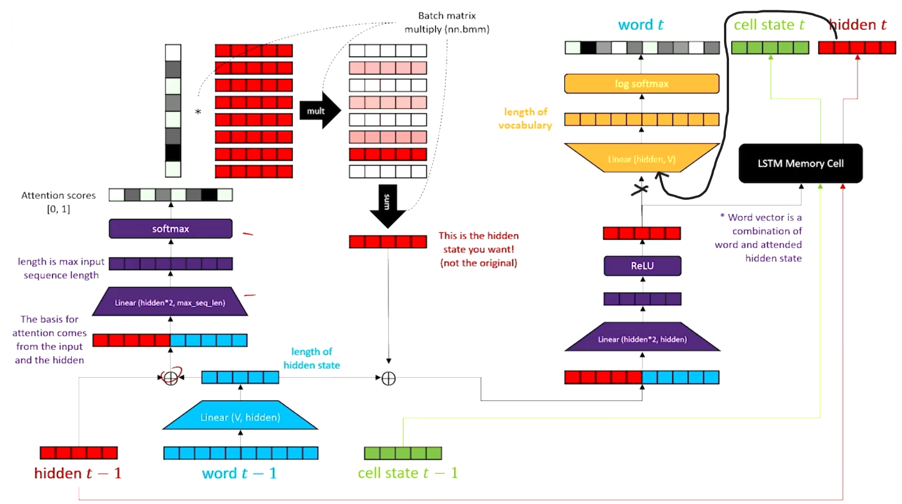

*Figure 9: A step-by-step (1-13) illustration of the attention mechanism.*

### Perplexity
Perplexity is an evaluation metric for language models. The lecture frames it as a way to measure how "confused" or "surprised" a language model is when it sees the true next word in a sequence.

Language models assign probability to a sequence:

$$P(w_1, ..., w_n) = \prod_{i=1}^{n} P(w_i | w_1, ..., w_{i-1})$$

If the model assigns high probability to the true words in a held-out sequence, it is less surprised, and perplexity is low. If it spreads probability mass across many possible next words, it is more confused, and perplexity is high.

#### Branching Factor Intuition
One way to understand perplexity is as an effective branching factor: the number of plausible next-token choices the model is considering.

For a single equally likely choice:

$$\text{branching factor} = \frac{1}{P(\text{option})}$$

Examples:

- If $P(\text{heads}) = 0.5$, the branching factor is $2$
- If the correct next token has probability $\frac{1}{45}$, perplexity behaves like choosing the correct side of a 45-sided die
- Lower perplexity means the model is less confused about the next word

#### Sequence-Level Perplexity
For a sequence, perplexity is the inverse geometric mean of the probabilities assigned to the true words:

$$PP(w_1, ..., w_n) = \sqrt[n]{\prod_{i=1}^{n} \frac{1}{P(w_i | w_1, ..., w_{i-1})}}$$

Equivalently:

$$PP(w_1, ..., w_n) = \left(\prod_{i=1}^{n} P(w_i | w_1, ..., w_{i-1})\right)^{-\frac{1}{n}}$$

Moving into log-space connects perplexity directly to cross entropy:

$$PP = \exp\left(-\frac{1}{n}\sum_{i=1}^{n}\log P(w_i | w_1, ..., w_{i-1})\right)$$

So perplexity is exponentiated normalized cross entropy.

#### How to Interpret Perplexity

- Perplexity is loss-like: **lower is better**
- It is evaluated on held-out/test text, not the training examples the model already optimized on
- Perplexity measures fluency and next-token predictability, not factual correctness
- A high perplexity does not always mean the generated text is nonsense; it can mean many fluent words were plausible, but the test set had only one actual next word
- During training we minimize cross-entropy loss; during testing we often report perplexity to make the result easier to interpret as "how many plausible choices the model had"

## Modern Neural Architectures
Modern neural language architectures move away from strictly recurrent processing. RNNs and LSTMs read one time slice at a time and compress all prior context into a hidden state. That made them flexible for variable-length sequences, but it also made long-range context difficult to preserve and made training hard to parallelize.

Transformers revisit an idea that used to seem impractical: process a large window of tokens at once. This makes the model very wide, but modern GPUs can parallelize the computation. The result is an architecture that can mix information across positions without waiting for recurrence to step through every token.

### Transformer
The Transformer combines three ideas already introduced earlier in the notes:

1. **Encoder-decoder structure**
    - Like seq2seq models, the Transformer separates representation building from output prediction
    - Unlike RNN seq2seq, it processes a whole input window at once instead of one token at a time

2. **Attention**
    - The model learns which input positions are useful for each prediction
    - Attention becomes the main way tokens exchange information

3. **Parallel computation**
    - Tokens in the context window can be embedded and transformed in parallel
    - This removes the strict sequential bottleneck of recurrence

At a high level:

- The **encoder** reads the input sequence and produces a stack of hidden states
- The **decoder** uses those hidden states plus previous output tokens to predict the next output token
- **Self-attention** lets each token representation be informed by other tokens in the same sequence

#### Encoder
The Transformer encoder takes an entire sequence of tokens at once. Instead of producing a single hidden vector, it produces a stack of hidden states: one hidden vector for each token position.

The encoder pipeline:

1. **Input tokens**
    - Each token starts as a one-hot vector over the vocabulary
    - The sequence is folded into a matrix where each row is a token/time slice

2. **Token embeddings**
    - Each one-hot token is mapped into a dense embedding
    - The output is a matrix of size roughly `sequence length x embedding length`

3. **Positional embeddings**
    - Because the network sees the whole sequence at once, order is not automatically encoded
    - Positional embeddings are added to token embeddings so the same word in different positions is represented slightly differently
    - The lecture describes these as combinations of sine/cosine waves at different frequencies, giving each position a distinct signal

4. **Masks**
    - Masks tell the model which positions should be ignored
    - Padding tokens, unavailable tokens, or task-specific hidden tokens can be zeroed out by masks

5. **Residual connection**
    - The encoder saves a copy of the embeddings before modifying them
    - Later layers add changes back onto this preserved representation
    - This keeps transformations from destroying the original token information

6. **Layer normalization**
    - Embedding rows can drift onto different numeric scales
    - Layer normalization puts them on a comparable scale before attention and feed-forward transformations

7. **Self-attention + feed-forward layers**
    - Self-attention mixes information across token positions
    - A feed-forward network expands and compresses embeddings so the model can refine the representation
    - This block is usually repeated multiple times

The encoder output is the final stack of contextual hidden states. Each row still corresponds to a token position, but it now contains information from other relevant tokens in the sequence.

#### Self-Attention
Self-attention is the central operation in the Transformer. The goal is to let each token position decide which other token positions are useful for building its contextual representation.

The lecture explains self-attention with a hash-table analogy:

- A normal hash table takes a **query**, matches it to a **key**, and retrieves a **value**
- Self-attention does a soft version of this:
    - The model creates queries, keys, and values from the token embeddings
    - A query does not need to match one key exactly
    - It can assign soft scores to many keys and retrieve a weighted combination of values

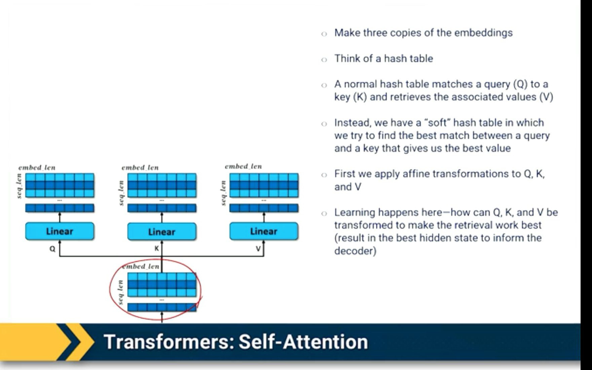

*Figure 10: Self-attention starts by making three learned copies of the embeddings: queries (Q), keys (K), and values (V). Learning happens in the linear transformations that shape Q, K, and V for useful retrieval.*

The core computation:

1. Start with the embedding matrix $X$
2. Apply learned linear transformations: $Q = XW_Q,\quad K = XW_K,\quad V = XW_V$
3. Compare queries against keys: $\text{scores} = QK^T$
4. Apply masks so forbidden positions cannot be attended to
5. Normalize scores with softmax: $A = \text{softmax}(\text{scores})$
6. Use attention weights to retrieve values: $\text{Attention}(Q,K,V) = AV$

In many Transformer descriptions, the score is scaled by $\sqrt{d_k}$:

$$\text{Attention}(Q,K,V) = \text{softmax}\left(\frac{QK^T}{\sqrt{d_k}}\right)V$$

The output is a new stack of embeddings. Each row is still tied to a token position, but now it can include information copied or blended from other positions.

#### Multi-Headed Self-Attention
Single-headed attention lets each token focus on one dominant retrieval pattern. Multi-headed attention lets each token attend in several different ways at the same time.

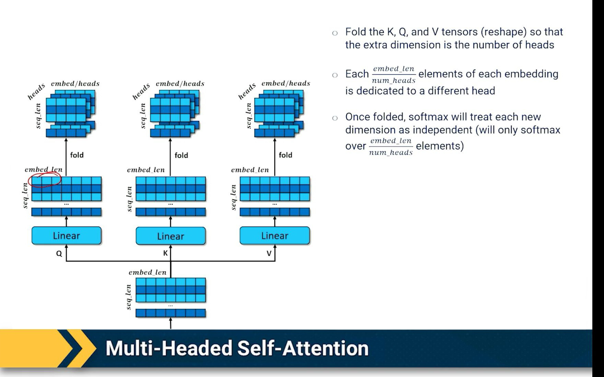

*Figure 11: Multi-headed attention folds Q, K, and V into an extra "heads" dimension. Each head can learn a different retrieval pattern, so a token can use several contextual clues instead of only one.*

The lecture describes this as folding the Q, K, and V tensors:

- Split the embedding dimension into $h$ heads
- Each head gets a smaller slice of the embedding
- Attention is computed independently inside each head
- The heads are then combined back into one representation

Why this matters:

- A token may need several context clues at once
- Different heads can specialize in different relationships
- One head might track syntactic agreement, another may track entity identity, and another may track local phrase structure
- This gives the model more expressive contextual embeddings than single-headed attention

#### Decoder
The Transformer decoder is similar to the encoder, but it is designed to predict output tokens.

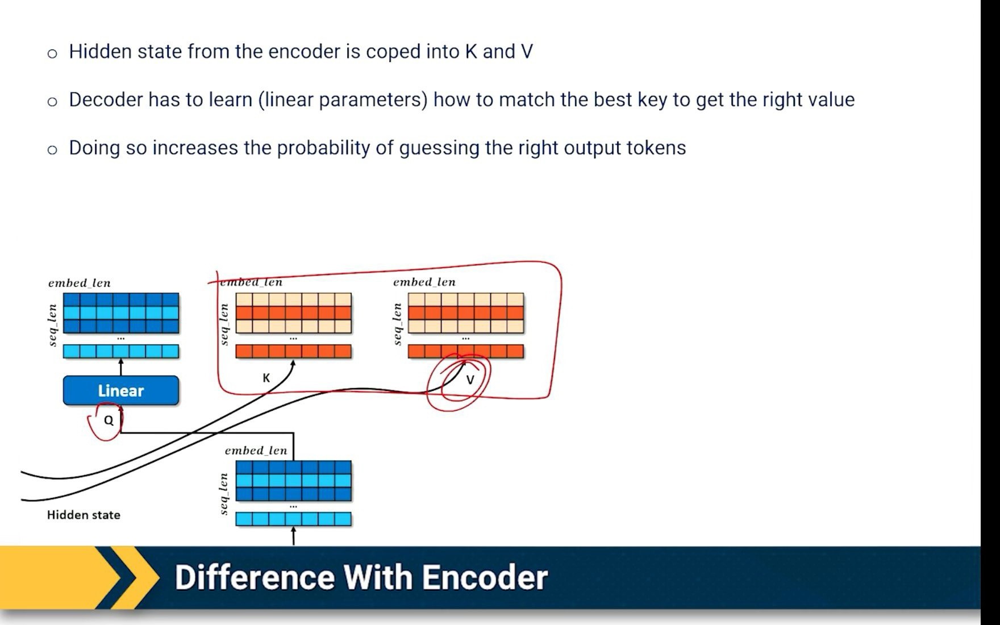

*Figure 12: The decoder differs from the encoder in how it uses attention: output-token embeddings become the query (Q), while the encoder hidden states are copied into keys (K) and values (V). This lets the decoder retrieve source-side information when predicting each output token.*

The decoder receives:

- The encoder's hidden-state stack
- The output-side tokens $y$
- Positional embeddings
- Masks

The key differences from the encoder:

1. **Shifted output tokens**
    - The decoder input is shifted so the model predicts the next token
    - Example: input `declared that juneteenth ...` predicts the next target token at each position

2. **Causal masking**
    - The decoder cannot look at future output tokens
    - This keeps training aligned with generation, where future words are unknown

3. **Encoder-decoder attention**
    - Decoder-side representations act as queries
    - Encoder hidden states provide keys and values
    - This lets the decoder ask: "which input-side hidden states are useful for predicting this output token?"

4. **Vocabulary prediction**
    - The decoder produces log probabilities over the vocabulary
    - Cross-entropy compares the predicted distribution to the true next token

During inference, the decoder generates autoregressively:

1. Start with a prompt or start token
2. Predict the next token
3. Append that token to the context
4. Repeat until an end token or max length is reached

### BERT
BERT stands for **Bidirectional Encoder Representations from Transformers**.

BERT is built around the Transformer encoder. Its main purpose is to build contextual embeddings: representations where the meaning of a token depends on the tokens around it.

Why contextual embeddings matter:

- The word "bank" can mean a river bank or a financial institution
- A static embedding would give both uses the same representation
- BERT lets the surrounding context change the representation of the token

BERT training uses a masked-language-modeling style objective:

1. Randomly mask a word in the input
2. Run the entire sequence through the Transformer encoder
3. Use both left and right context to predict the masked word
4. Update parameters so the model becomes better at infilling

BERT's workflow is usually:

1. **Pretrain** on a large corpus with masked-token prediction so the model learns broad contextual embeddings
2. **Reuse or fine-tune** the pretrained encoder for a downstream task
3. Add a task-specific prediction head when needed, such as a classifier or span selector

Example tasks BERT supports well:

- **Infilling**: predict a missing word inside a sentence
- **Question answering**: concatenate context and question, then identify the answer span
- **Semantic similarity/retrieval**: compare contextual embeddings with cosine similarity
- **Fine-tuning**: start from the pretrained model and continue training on a specialized corpus

BERT is not ideal for open-ended left-to-right text generation because it is bidirectional. It expects to see context on both sides of a masked word, but generation only has access to the past.

### GPT
GPT stands for **Generative Pre-trained Transformer**.

GPT modifies the Transformer setup for left-to-right generation. Unlike BERT, GPT should not look into the future. It predicts the next token from the tokens that came before it.

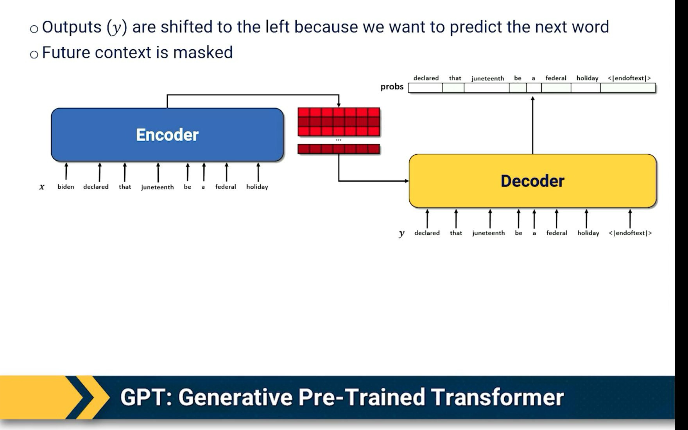

*Figure 13: GPT-style training shifts outputs left and masks future context. The lecture diagram shows the shifted-token objective using an encoder-decoder illustration; the key idea for GPT-style models is that each position predicts the next word using only previous words.*

GPT's main architectural idea:

- Use Transformer blocks in a decoder-only style
- Apply causal masks so position $t$ can attend only to positions $\leq t$
- Train on next-token prediction across large text corpora
- Remove the separate encoder-decoder cross-attention used in translation-style Transformers; the prompt itself is the context

Training objective:

$$P(w_1, ..., w_n) = \prod_{i=1}^{n} P(w_i | w_1, ..., w_{i-1})$$

At each position:

1. The model sees previous tokens
2. It produces a probability distribution over the vocabulary
3. Cross-entropy loss rewards high probability on the true next token

Why GPT works well for generation:

- The training objective directly matches the inference behavior
- The model learns continuation: each new token becomes part of the context for the next token
- Prompts can provide task instructions, examples, or constraints inside the context window

Common GPT-style uses:

- Text completion
- Story generation
- Summarization and rewriting through prompting
- Few-shot learning by placing examples in the prompt
- Zero-shot task following when the instruction itself is enough context

### Why Do Modern Large Language Models Use Decoder-Only Architectures?

Modern large language models (LLMs) like GPT-style, LLaMA-style, and PaLM-style systems predominantly use decoder-only architectures rather than full encoder-decoder designs for several key reasons:

1. **Computational Efficiency**
    - Decoder-only models are more parameter-efficient since they do not need separate encoder parameters
    - Training and inference can be optimized more effectively with a single unified architecture
    - Reduced memory footprint compared to maintaining both encoder and decoder components

2. **Natural Language Generation Focus**
    - LLMs primarily focus on text generation tasks rather than translation/reconstruction
    - Decoder architecture is well-suited for autoregressive generation of text
    - No need for explicit encoding of input when the goal is primarily generating coherent continuations

3. **Self-Attention Mechanics**
    - Decoder's masked self-attention naturally fits the left-to-right language modeling objective
    - Allows the model to effectively learn dependencies and patterns in sequential text data
    - Causal masking prevents looking at future tokens, matching the next-token prediction training setup

4. **Scalability Benefits**
    - Simpler architecture makes it easier to scale to massive model sizes
    - Fewer architectural components to optimize during training
    - More straightforward to parallelize across multiple accelerators

5. **Empirical Success**
    - Decoder-only models have demonstrated strong performance across many NLP tasks through prompting
    - Proven highly effective at few-shot and zero-shot learning
    - Strong results in both general language understanding and specialized domains

The success of decoder-only architectures has made them the de facto standard for general-purpose generative LLMs, though encoder-decoder models remain valuable for tasks where there is a clear source sequence and target sequence, such as machine translation and some summarization systems.
