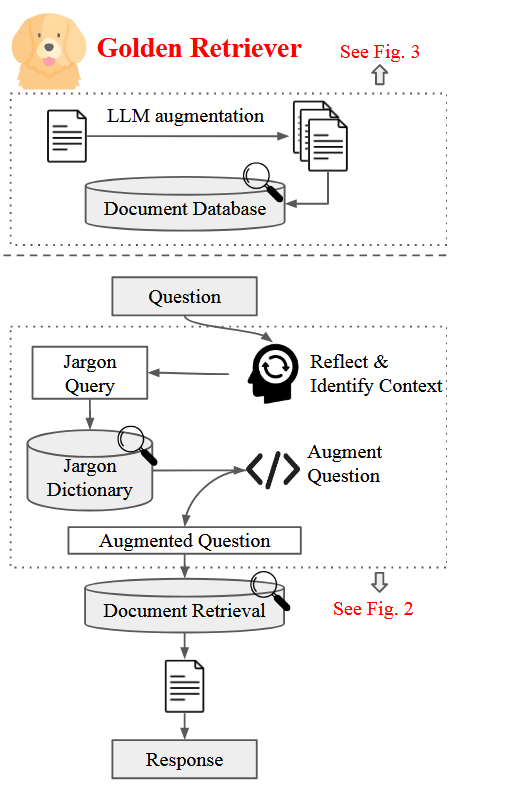
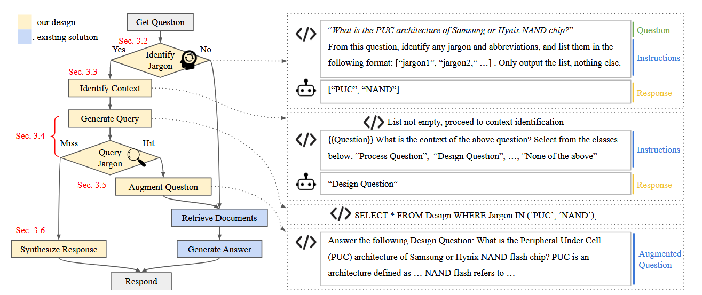

### Content

- [Golden-Retriever: High-Fidelity Agentic Retrieval Augmented Generation for Industrial Knowledge Base](#golden-retriever-high-fidelity-agentic-retrieval-augmented-generation-for-industrial-knowledge-base)

### Golden-Retriever: High-Fidelity Agentic Retrieval Augmented Generation for Industrial Knowledge Base

*Publish date: 2024-07-20*

**Challenges in Traditional RAG:**
- Ambiguous jargon in user queries often leads to retrieval of irrelevant documents, a common issue in industrial knowledge bases.
- User queries typically lack context, making it difficult to retrieve the most relevant documents.

**Golden-Retriever's Solution:**
- Enhances the traditional RAG framework by incorporating a reflection-based question augmentation step before document retrieval.

  

*Figure: The framework of Golden-Retriever. It reflects upon the question, identifies its context, and augments the question by querying a jargon dictionary before document retrieval. The augmented question allows RAG to faithfully retrieve the most relevant documents despite ambiguous jargon or lack of explicit context.*

**Components of Golden-Retriever:**
- **Offline Component:**
  - Enhances the document database to improve the relevance of retrieved documents before deploying the knowledge base chatbot.
  - Collects various documents (e.g., slides, images with text, tables) from the company.
  - Extracts text from images and tables, breaks it into smaller chunks (~4,000 tokens), summarizes each chunk using LLM, and saves them in the document database.

- **Online Component:**
  1. **Identify Jargon and Abbreviations:** Prompts the system to identify all jargon and abbreviations in user queries for further processing.
  2. **Context Identification:** Uses a prompt template with pre-specified context names and descriptions to identify the context of the question. Applies few-shot examples with Chain-of-Thought reasoning.
  3. **Query Jargons:** Utilizes a code-based approach to synthesize SQL queries.
  4. **Augment Question:** Enhances the original user question with additional information, structuring it for effective document retrieval.
  5. **Handle Query Misses:** Implements a fallback mechanism when jargon terms are not found, generating a response indicating missing information. Instructs users to check jargon spelling or contact the knowledge base manager to add new terms.

*Figure: Left: the workflow diagram of the online inference part of Golden-Retriever. Right: example interactions between the system and the LLM at the intermediate steps of the workflow. The system prompts LLM to generate intermediate responses, which are saved, accessed, and used for future steps in the workflow.*

#### Resource
- [Research Paper](https://arxiv.org/abs/2408.00798)
- [Source Code](https://github.com/jmanhype/Golden-Retriever)
