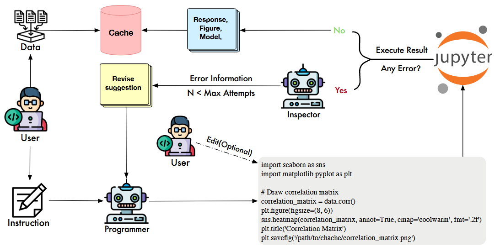
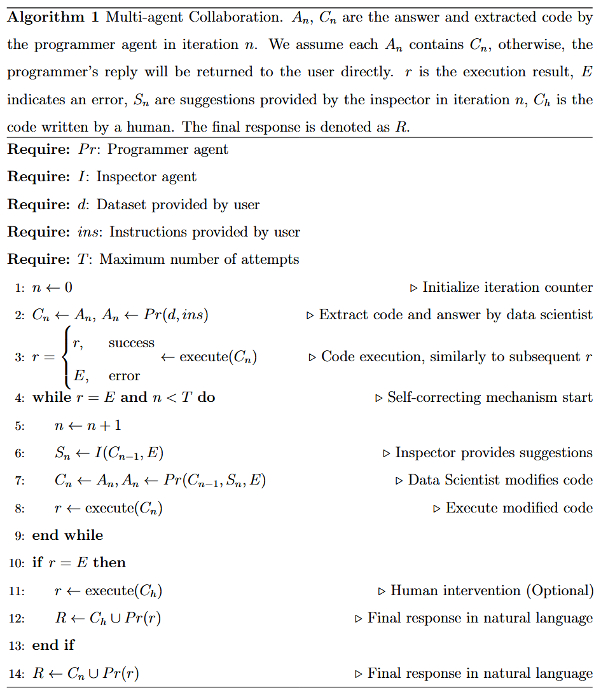

### Content

- [LAMBDA: A Large Model Based Data Agent](#lambda-a-large-model-based-data-agent)

### LAMBDA: A Large Model Based Data Agent

LAMBDA is an open-source, code-free multi-agent data analysis system designed to make data analysis accessible to users without programming experience. The system has several key objectives:

- Enabling code-free data analysis by automatically generating programming code
- Seamlessly integrating human domain knowledge with AI capabilities
- Supporting data science education through interactive learning
- Automatically generating comprehensive analysis reports and exportable code

#### Problem Statement & Motivation

Existing research has not adequately addressed the high degree of flexibility required in real-world data analysis scenarios, particularly when it comes to incorporating custom algorithms or statistical models based on user preferences. Additionally, traditional function-calling approaches face significant challenges in statistical and data science applications:

- The sheer volume of APIs/functions, their complex interrelationships, and extensive documentation often exceed LLM capacity
- As the number of available APIs increases, the model's ability to accurately select appropriate functions deteriorates

#### System Architecture

LAMBDA employs a dual-agent architecture consisting of:

1. **Data Scientist (Programmer) Agent**
   - Primary role: Code generation and user interaction
   - Guided by system prompts defining its role, context, and I/O formats
   - Workflow:
     - Writes code based on user/inspector instructions
     - Executes code through kernel
     - Generates comprehensive responses including results summary and next-step suggestions

2. **Inspector Agent**
   - Primary role: Error detection and correction
   - Analyzes execution errors in programmer's code
   - Provides actionable revision suggestions for code improvement
   - Works iteratively until code executes successfully or reaches maximum attempts

*Figure: Overview of LAMBDA showing the interaction between programmer agent for code generation and inspector agent for error evaluation. The system supports human intervention when needed.*

#### Key Features

##### Knowledge Integration Mechanism
- Implements a Key-Value (KV) knowledge structure
  - Key: Resource descriptions (e.g., function docstrings)
  - Value: Corresponding code implementations
- Enables domain-specific task execution
- Provides flexibility for complex analysis challenges
- Facilitates easy incorporation of user resources into the agent system

##### Technical Implementation
- Uses IPython as the system kernel for sequential data processing
- Supports comprehensive report generation including:
  - Data processing steps
  - Data visualizations
  - Model descriptions
  - Evaluation results
- Enables code export functionality

##### User Interface & Interaction
- Chat-based interface for natural interaction
- Step-by-step guided prompting
- Human-in-the-loop design allowing direct code modification
- Extensive prompt templates for various tasks:
  - Data analysis
  - Dataset handling
  - Error resolution
  - Knowledge integration
  - Code debugging

*Figure: Detailed view of the collaborative process between programmer and inspector agents.*

#### Resources
- [Research Paper](https://arxiv.org/pdf/2407.17535)
- [Live Demo](https://xxxlambda.github.io/lambda_webpage/)
- [Source Code](https://github.com/Stephen-SMJ/LAMBDA)