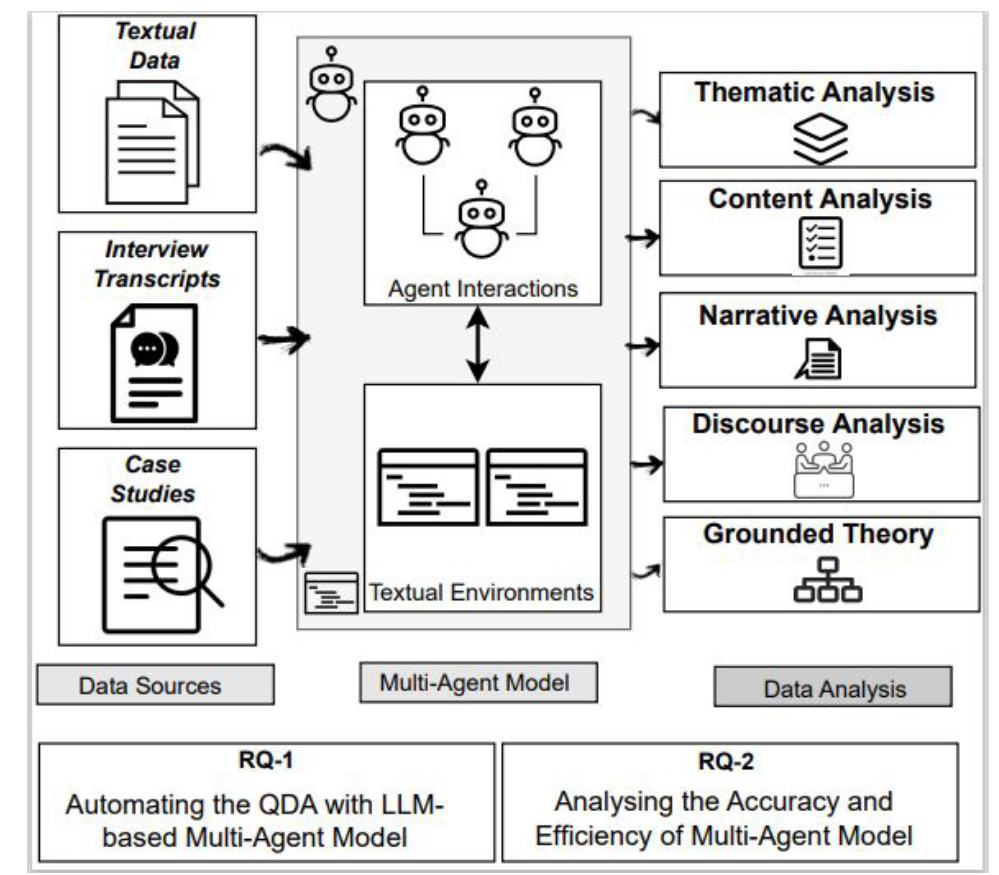
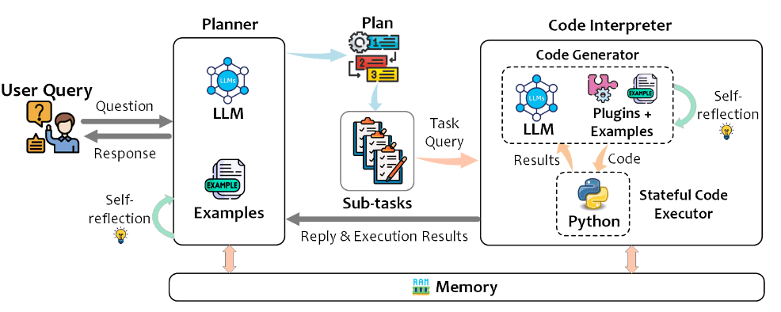
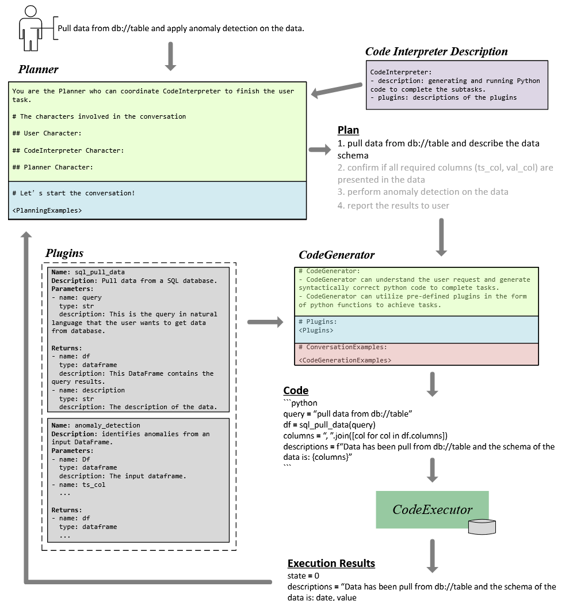

### Content

- [LAMBDA: A Large Model Based Data Agent](#lambda-a-large-model-based-data-agent)
- [Can Large Language Models Serve as Data Analysts? A Multi-Agent Assisted Approach for Qualitative Data Analysis](#can-large-language-models-serve-as-data-analysts-a-multi-agent-assisted-approach-for-qualitative-data-analysis)
- [TaskWeaver: A Code-First Agent Framework](#taskweaver-a-code-first-agent-framework)

### LAMBDA: A Large Model Based Data Agent

LAMBDA is an open-source, code-free multi-agent data analysis system designed to make data analysis accessible to users without programming experience. The system has several key objectives:

- Enabling code-free data analysis by automatically generating programming code
- Seamlessly integrating human domain knowledge with AI capabilities
- Supporting data science education through interactive learning
- Automatically generating comprehensive analysis reports and exportable code

#### Problem Statement & Motivation

Existing research has not adequately addressed the high degree of flexibility required in real-world data analysis scenarios, particularly when it comes to incorporating custom algorithms or statistical models based on user preferences. Additionally, traditional function-calling approaches face significant challenges in statistical and data science applications:

- The sheer volume of APIs/functions, their complex interrelationships, and extensive documentation often exceed LLM capacity
- As the number of available APIs increases, the model's ability to accurately select appropriate functions deteriorates

#### System Architecture

LAMBDA employs a dual-agent architecture consisting of:

1. **Data Scientist (Programmer) Agent**
   - Primary role: Code generation and user interaction
   - Guided by system prompts defining its role, context, and I/O formats
   - Workflow:
     - Writes code based on user/inspector instructions
     - Executes code through kernel
     - Generates comprehensive responses including results summary and next-step suggestions

2. **Inspector Agent**
   - Primary role: Error detection and correction
   - Analyzes execution errors in programmer's code
   - Provides actionable revision suggestions for code improvement
   - Works iteratively until code executes successfully or reaches maximum attempts

*Figure: Overview of LAMBDA showing the interaction between programmer agent for code generation and inspector agent for error evaluation. The system supports human intervention when needed.*

#### Key Features

##### Knowledge Integration Mechanism
- Implements a Key-Value (KV) knowledge structure
  - Key: Resource descriptions (e.g., function docstrings)
  - Value: Corresponding code implementations
- Enables domain-specific task execution
- Provides flexibility for complex analysis challenges
- Facilitates easy incorporation of user resources into the agent system

##### Technical Implementation
- Uses IPython as the system kernel for sequential data processing
- Supports comprehensive report generation including:
  - Data processing steps
  - Data visualizations
  - Model descriptions
  - Evaluation results
- Enables code export functionality

##### User Interface & Interaction
- Chat-based interface for natural interaction
- Step-by-step guided prompting
- Human-in-the-loop design allowing direct code modification
- Extensive prompt templates for various tasks:
  - Data analysis
  - Dataset handling
  - Error resolution
  - Knowledge integration
  - Code debugging

*Figure: Detailed view of the collaborative process between programmer and inspector agents.*

#### Resources
- [Research Paper](https://arxiv.org/pdf/2407.17535)
- [Live Demo](https://xxxlambda.github.io/lambda_webpage/)
- [Source Code](https://github.com/Stephen-SMJ/LAMBDA)

### Can Large Language Models Serve as Data Analysts? A Multi-Agent Assisted Approach for Qualitative Data Analysis

Qualitative research is a type of research that focuses on collecting and analyzing non-numerical data (e.g., text, video, or audio) to understand concepts, opinions, or experiences.

This paper explores using LLMs to automate and expedite qualitative data analysis processes. The model adeptly interprets massive volumes of textual data and interview transcripts to autonomously perform the chosen approach for qualitative data analysis.

In the framework, each agent in the system is a specialized instance of an LLM, trained to handle different aspects of qualitative data analysis.

*Figure: A workflow overview of the proposed system for automation of qualitative data analysis.*

#### Resource
- [Research Paper](https://arxiv.org/pdf/2402.01386)

### TaskWeaver: A Code-First Agent Framework
TaskWeaver is a framework that converts user requests into executable code and treats user-defined plugins as callable functions. It provides support for rich data structures, flexible plugin usage, and dynamic plugin selection, leveraging LLM coding capabilities for complex logic.

Key limitations of existing frameworks that TaskWeaver addresses:
- Lack of native support for handling rich data structures
- Limited configuration options for incorporating domain knowledge 
- Inability to meet diverse user requirements

The core architecture consists of three main components:

1. **Planner**: The system entry point that:
   - Breaks down user requests into subtasks and manages execution with self-reflection
   - Transforms execution results into human-readable responses

2. **Code Interpreter (CI)**: Contains two sub-components:
   - Code Generator (CG): Generates code for subtasks from the Planner using available plugins
   - Code Executor (CE): Executes generated code and maintains execution state

3. **Memory Module**: Centralizes chat history between user and internal roles

*Figure: The overview of TaskWeaver.*

A key use case is anomaly detection in databases, which uses a two-layer planning process:
1. Planner generates high-level steps to fulfill the request
2. CI devises detailed execution plans with chain-of-thought reasoning and code generation

The workflow begins with the Planner receiving a user query along with CI descriptions (plugin/function documentation). The CG receives comprehensive plugin definitions including function names, descriptions, arguments and return values. Execution results flow back to the Planner to determine next steps.

*Figure: the workflow of the anomaly detection use case.*

#### Component Details

**Planner**
As the system controller, the Planner:
- Receives and decomposes user queries into sub-tasks
- Generates initial plans based on LLM knowledge and domain examples
- Refines plans considering sub-task dependencies
- Assigns tasks to CI for code generation
- Updates plans based on execution results following ReAct pattern
- Manages the process until completion

**Code Generator (CG)**
The CG synthesizes Python code by:
- Combining plugin system and code interpreter capabilities
- Leveraging user-customized plugins and examples
- Using plugin schemas to understand capabilities
- Ensuring plugin implementations match schemas

**Code Executor (CE)**
The CE handles code execution by:
- Running code generated by CG
- Managing dependent modules and plugins
- Preserving context and logs
- Returning results to Planner

#### Resource
- [Research Paper](https://arxiv.org/pdf/2311.17541)
- [Source Code](https://github.com/microsoft/TaskWeaver)
