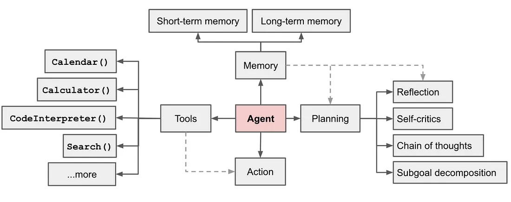
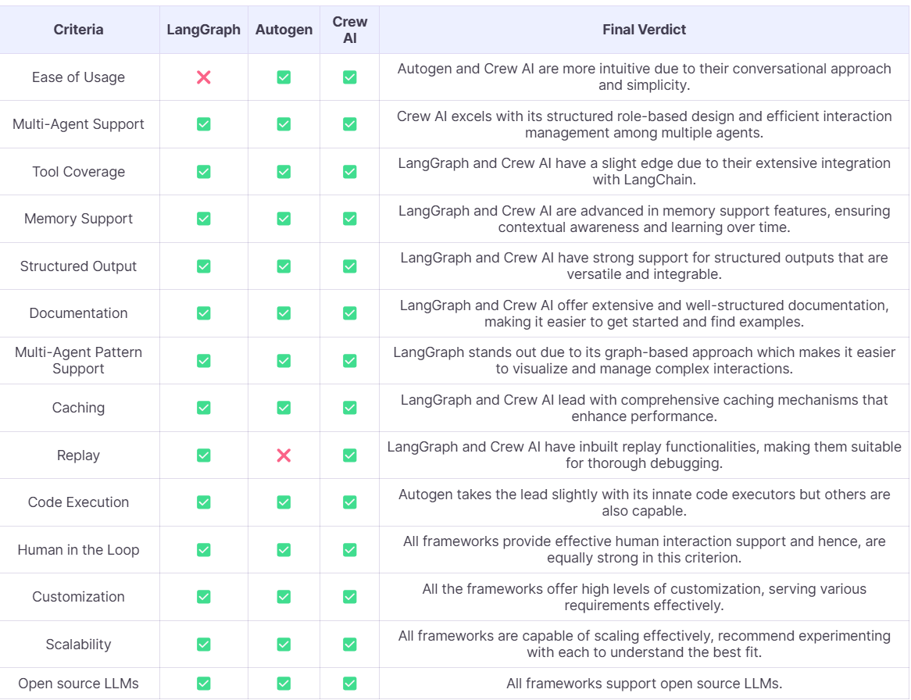

# AI Agents

## Contents

## AI Agent Types
An "agent" is an automated reasoning and decision engine. The key agent components can include, but not limited to:
- Break down of a complex question into smaller ones
- Choosing an external tool to use and coming up with parameters for calling the Tool
- Planning out a set of tasks
- Storing previosuly completed tasks in a memory module. 

### When to Use Agents
Agents are highly beneficial when tasks require complex decision-making, autonomy, and adaptability. They excel in environments where the workflow is dynamic and involves multiple steps or interactions that can benefit from automation.
### When Not to Uss Agents
- Tasks that are straightforward, infrequent, or require minimal automation.
- Tasks that require deep domain-specific knowledge and expertise, e.g., legal or medical advice.
- Tasks that require a high level of human empathy, creativity, or subjective judgement, e.g., psychotherapy.
## AI Agent Frameworks
Three prominent frameworks for building AI agents are:
- [AutoGen](https://github.com/microsoft/autogen)
- [CrewAI](https://github.com/crewAIInc/crewAI)
- [LangGraph](https://github.com/langchain-ai/langgraph)

### Comparison summary

## Open Source Agents
- [AutoGPT](https://github.com/Significant-Gravitas/AutoGPT)
- [BabyAGI](https://github.com/yoheinakajima/babyagi)
- [SuperAGI](https://github.com/TransformerOptimus/SuperAGI)
- [ShortGPT](https://github.com/RayVentura/ShortGPT)
- [ChatDev](https://github.com/OpenBMB/ChatDev)
- [AutoGen](https://github.com/microsoft/autogen)
- [MetaGPT](https://github.com/geekan/MetaGPT)
- [Camel](https://github.com/camel-ai/camel)
- [LoopGPT](https://github.com/farizrahman4u/loopgpt/tree/main)
- [JARVIS](https://github.com/microsoft/JARVIS)
- [OpenAGI](https://github.com/agiresearch/OpenAGI)

## Papers/Books
- [Agent AI: Surveying The Horizons of Multimodal Interaction](https://arxiv.org/pdf/2401.03568). Nice overview (book) on AI agents.

## Online Articles
1. [Navigating the New Types of LLM Agents and Architectures](https://medium.com/towards-data-science/navigating-the-new-types-of-llm-agents-and-architectures-309382ce9f88) 
2. [AI Agents — From Concepts to Practical Implementation in Python](https://towardsdatascience.com/ai-agents-from-concepts-to-practical-implementation-in-python-fb26789b1560). This uses CrewAI framework for implementation.4
3. [Top 11 Open-Source Autonomous Agents & Frameworks: The Future of Self-Running AI](https://www.taskade.com/blog/top-autonomous-agents/#h-what-are-autonomous-agents)
4. [Mastering Agents: LangGraph Vs Autogen Vs Crew AI](https://www.rungalileo.io/blog/mastering-agents-langgraph-vs-autogen-vs-crew)