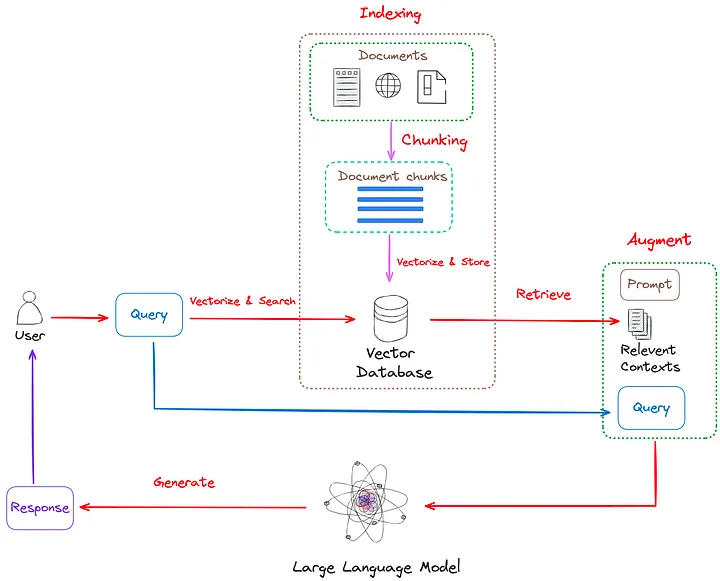
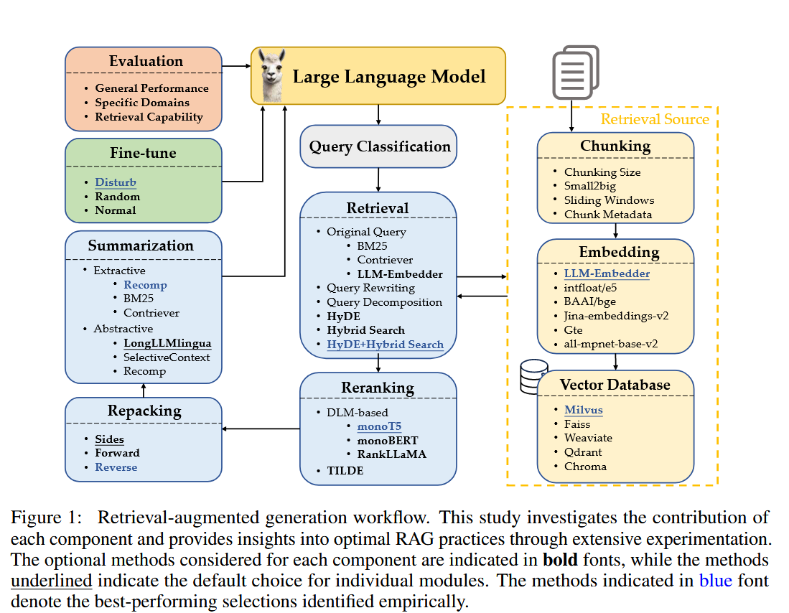

# RAG

## Contents
- [Introduction](#Introduction)
- [Papers](#papers)
- [Online Articles](#Online-Articles)   
- [Implementation](#Implementation)

## Introduction
RAG stands for Retrieval-Augumented Generation. RAG system works two steps: 1. Retrieve: It retrieves relevant information from a large corpus of text. 2. Generate: It generates a response based on the retrieved information. Common Use-case: question answering, document summarization, content generation.

Why do we need RAG? 1. avoid hallucination 2. timeliness 3. LLMs cannot access private data, feed more internal/user private data to get customized results. 4. Answer constraint. 

A naive RAG mainly consists of the following steps:
1. **Indexing**: Cleaning and extracting the raw text into standardized plain text -> Chunking -> transformed into vector via embedding -> create (key, value) pairs, which is (index, vector) pairs.
2. **Retrieval**: users query processed by an encoding model -> query embedding -> similarity search on a vector database -> top-k results are retrieved.
3. **Generation**: user query and retrieved documents are fed into a prompt template -> generate the response.

## Best practices of RAG
In Paper [2]:
> A typical RAG workflow usually contains multiple intervening processing steps: query classification (determining whether retrieval is necessary for a given input query), retrieval (efficiently obtaining relevant documents for the query), reranking (refining the order of retrieved documents based on their relevance to the query), repacking (organizing the retrieved documents into a structured one for better generation), summarization (extracting key information for response generation from the repacked document and eliminating redundancies) modules. Implementing RAG also requires decisions on the ways to properly split documents into chunks, the types of embeddings to use for semantically representing these chunks, the choice of vector databases to efficiently store feature representations, and the methods for effectively fine-tuning LLMs

## Papers
1.  Lewis, Patrick, Ethan Perez, Aleksandra Piktus, Fabio Petroni, Vladimir Karpukhin, Naman Goyal, Heinrich Küttler, et al. “Retrieval-Augmented Generation for Knowledge-Intensive NLP Tasks.” arXiv, April 12, 2021. http://arxiv.org/abs/2005.11401.
> The first paper talks about RAG - models which combine pre-trained parametric and non-parametric memory for language generation. RAG models, the parametric memory is a pre-trained seq2seq transformer and the non-parametric memory is a dense vector index of Wikipedia, accessed with a pre-trained neural retriever.
other resource: Youtube video
- https://www.youtube.com/watch?v=JGpmQvlYRdU (by the Author of the paper)
- https://www.youtube.com/watch?v=dzChvuZI6D4 (explanation of the paper)
2. Wang, Xiaohua, Zhenghua Wang, Xuan Gao, Feiran Zhang, Yixin Wu, Zhibo Xu, Tianyuan Shi, et al. “Searching for Best Practices in Retrieval-Augmented Generation.” arXiv, July 1, 2024. http://arxiv.org/abs/2407.01219.
> it gives an overview of current practice of RAG. A good tech blog to explain the paper is [this] (https://pub.towardsai.net/the-best-practices-of-rag-300e313322e6)

3. Shi, Yunxiao, Xing Zi, Zijing Shi, Haimin Zhang, Qiang Wu, and Min Xu. “Enhancing Retrieval and Managing Retrieval: A Four-Module Synergy for Improved Quality and Efficiency in RAG Systems.” arXiv, July 15, 2024. http://arxiv.org/abs/2407.10670.
> This paper introduces 4 modules to solving serveral key challenges with RAG.  
## Online Articles
### Introduction
- [Introduction to RAG — GenAI Systems for Knowledge](https://medium.com/curiosity-ai/introduction-to-rag-genai-systems-for-knowledge-918a34054228)
- [A Brief Introduction to Retrieval Augmented Generation(RAG)](https://medium.com/ai-in-plain-english/a-brief-introduction-to-retrieval-augmented-generation-rag-b7eb70982891)
- [The Best Practices of RAG](https://pub.towardsai.net/the-best-practices-of-rag-300e313322e6)

## Implementation
- https://scriv.ai/guides/retrieval-augmented-generation-overview/
- https://towardsdatascience.com/a-beginners-guide-to-building-a-retrieval-augmented-generation-rag-application-from-scratch-e52921953a5d
- [Retrieval-Augmented Generation (RAG): From Theory to LangChain Implementation](https://towardsdatascience.com/retrieval-augmented-generation-rag-from-theory-to-langchain-implementation-4e9bd5f6a4f2)

