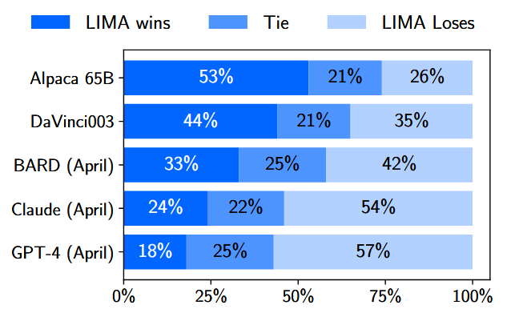
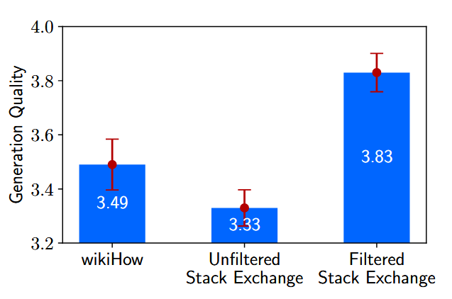
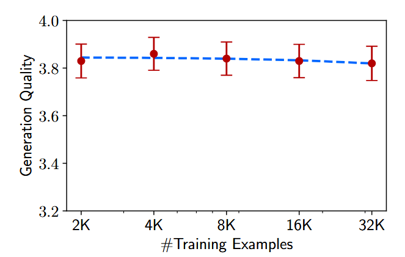

## Content

## LIMA: Less Is More for Alignment

[ArXiv](https://arxiv.org/abs/2305.11206)

### Summary of the Paper

This paper demonstrates that a 65B parameter LLaMA language model can achieve strong performance using only **1,000 high-quality training examples** (prompts + responses) for fine-tuning. The authors detail the process of selecting high-quality training data and show that their approach even outperforms OpenAI's RLHF-based DaVinci-003.

### Key Hypothesis

The paper introduces the **Superficial Alignment Hypothesis**:
> A model's knowledge and capabilities are learned almost entirely during pretraining, while alignment teaches it which subdistribution of formats should be used when interacting with users.

If this hypothesis holds, it explains why fine-tuning a pretrained model with a small, high-quality dataset can be sufficient.

### Data Selection and Quality

- Among the 1,000 examples, **250 were authored by the researchers** to ensure high quality. Many responses acknowledge the question before providing the answer, resembling a "chain of thought" approach.
- The authors emphasize that **diversity in input** and **quality in output** are more impactful than simply increasing the quantity of training data.

### Evaluation

The authors evaluated LIMA using **human evaluation** and **GPT-4 evaluation**, comparing it against DaVinci-003 (RLHF-based) and other large language models. LIMA demonstrated competitive performance.

*Human preference evaluation, comparing LIMA to 5 different baselines across 300 test prompts.*

### Data Quality vs. Quantity

1. **Impact of Data Quality**:
    - The authors trained a 7B LLaMA model on three datasets:
      - **Filtered Stack Exchange**: Diverse prompts with high-quality responses.
      - **Unfiltered Stack Exchange**: Diverse prompts without quality filtering.
      - **wikiHow**: High-quality responses but limited to "how-to" prompts.
    - Results show that **diverse and high-quality data** lead to better performance.

    
    *Performance of 7B models trained with 2,000 examples from different sources.*

2. **Impact of Data Quantity**:
    - Increasing the number of examples (up to 16x) from quality-filtered Stack Exchange did not significantly improve performance, indicating diminishing returns from scaling data quantity.

    
    *Performance of 7B models trained with exponentially increasing amounts of data.*

### Key Takeaway

The authors conclude that for alignment purposes, **scaling input diversity and output quality** has measurable benefits, while scaling data quantity alone offers limited gains.
